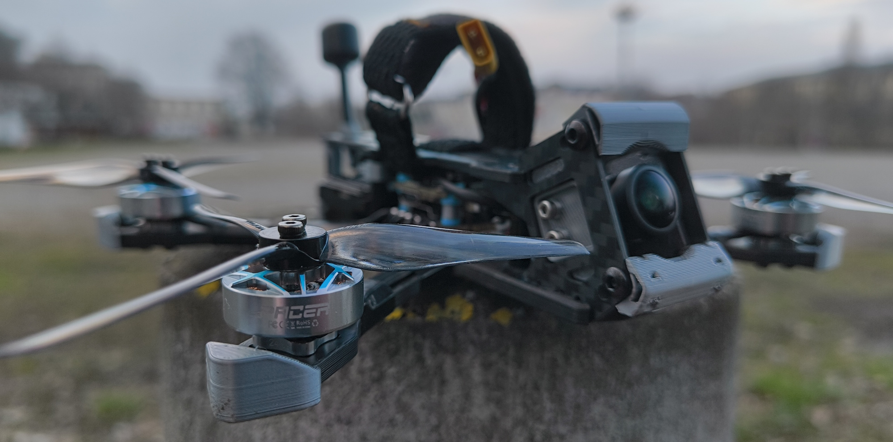

# Quad-JeNo35-3D-Parts
The Jone35 is a very stylish frame that I really like.
Here are the 3d printed parts I designed for it:
- FrontBumper.stl
- ..

Link to orginal Repo: [github/WE-are-FPV/JeNo3.5](https://github.com/WE-are-FPV/JeNo-3-3.5/)

## Where to get the Frame???
### EU
https://fpvcncdrone.com/product/jeno-35/  
https://www.lacameraembarquee.fr/we-are-fpv/17776-chassis-we-are-fpv-jeno-35.html

### Australia
https://cubefpv.com/product/fpv-frame-jeno-3-5-m3-v1-1/
- Has 3D Parts as well

## Reviews
https://www.youtube.com/watch?v=k95wcKga9mA
